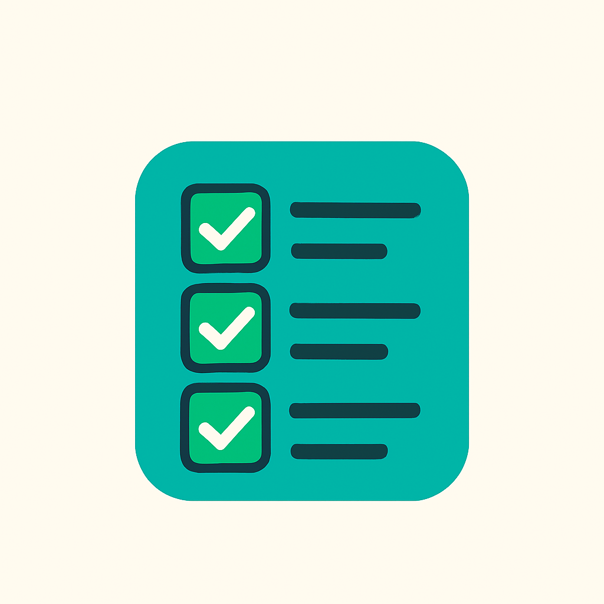

# Task Flow - Android App



## Description
**Task Flow** is an Android app designed to help users manage and track their tasks. Users can create and view tasks with details such as titles, descriptions, deadlines, and statuses. The app automatically updates the status of tasks to **Completed** when the deadline has passed. 

This app utilizes Room Database to store task data locally, enabling offline functionality.

---

## Features

- **User Authentication**: Users can sign up and log in to securely manage their tasks.
- **Task Management**: Users can create new tasks and view existing ones.
- **Auto Task Status Update**: The app automatically sets the task status to **Completed** when the deadline has passed.
- **Offline Support**: All task data is stored locally using **Room Database**, ensuring that users can access and manage their tasks even without an internet connection.
- **Task Filtering**: Tasks can be filtered by their status (Pending or Completed).
- **Responsive UI**: Designed with an intuitive interface for easy navigation.

---

## Requirements

- Android Studio
- Java 8 or higher
- Android SDK

---

## Setup and Installation

1. **Clone the repository**:
   ```bash
   git clone https://github.com/Just-NK14/task-flow.git
   ```

2. **Open the project in Android Studio**:
   - Launch Android Studio.
   - Open the `task-flow` project.

3. **Sync the project with Gradle**:
   - Click on **Sync Now** when prompted to sync the project with Gradle.

4. **Build and Run the app**:
   - Select your device or emulator.
   - Click **Run** to launch the app.

---

## Future Work

- **Language Translation**: The app currently supports translation to **Telugu** and **Hindi**. However, there is an issue when switching between the languages, causing the app to crash. This feature is still a work in progress and will be improved in the future.

---
